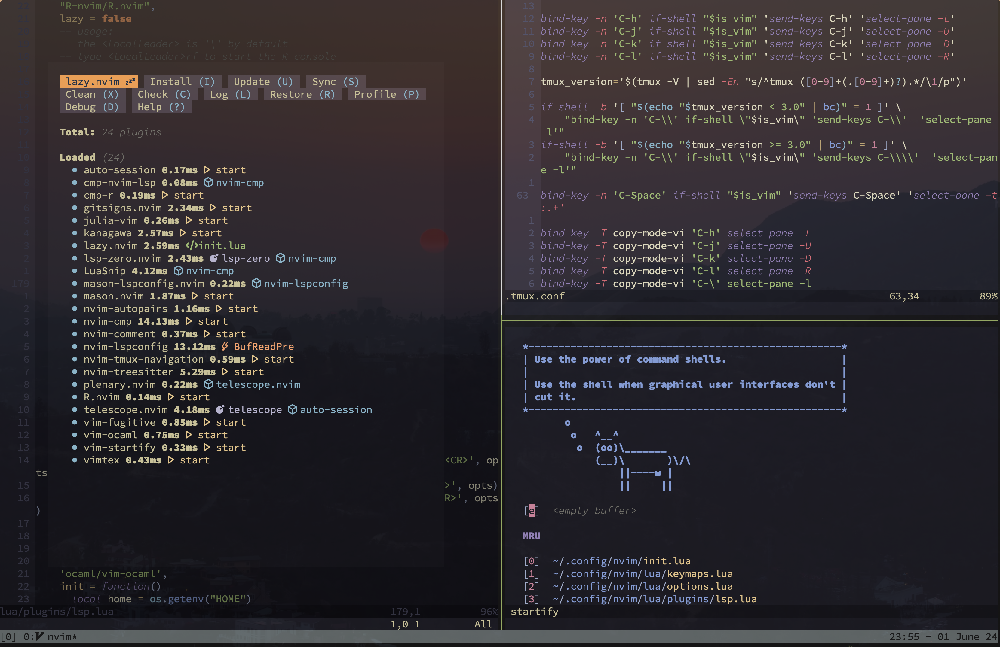

# Neo**vim** configuration for Mac arm64

## screenshots



## features

- goes well with [Alacritty](https://github.com/alacritty/alacritty)
- plugin manager: [lazy.nvim](https://github.com/folke/lazy.nvim)
- LSP setup: Lua, LaTeX, R, Python, Julia, OCaml.

## zsh

```zsh
brew --version
```
Homebrew 4.3.1

```zsh
echo 'eval "$(/opt/homebrew/bin/brew shellenv)"' >> ~/.zprofile

source ~/.zprofile
```

```zsh
brew install neovim

brew list --versions neovim
```
neovim 0.9.5

```zsh
brew install ripgrep

brew list --versions ripgrep
```
ripgrep 14.1.0

```zsh
brew install black

brew list --versions black
```
black 24.4.2

```zsh
brew tap homebrew/cask-fonts

brew install --cask font-hasklug-nerd-font

brew list --cask --versions font-hasklug-nerd-font
```
font-hasklug-nerd-font 3.2.1

```zsh
brew install --cask alacritty

brew list --cask --versions alacritty
```
alacritty 0.13.2

```zsh
brew install zsh-autosuggestions

echo "source $(brew --prefix)/share/zsh-autosuggestions/zsh-autosuggestions.zsh" >> ~/.zshrc

brew list --versions zsh-autosuggestions
```
zsh-autosuggestions 0.7.0

```zsh
brew install zsh-syntax-highlighting

echo "source $(brew --prefix)/share/zsh-syntax-highlighting/zsh-syntax-highlighting.zsh" >> ~/.zshrc

brew list --versions zsh-syntax-highlighting
```
zsh-syntax-highlighting 0.8.0

```zsh
brew install tmux

git clone https://github.com/tmux-plugins/tpm ~/.tmux/plugins/tpm

brew list --versions tmux
```
tmux 3.4_1

```zsh
brew install yq

brew list --versions yq
```
yq 4.44.1

```zsh
echo "alias vim=nvim" >> ~/.zshrc

echo 'alias vimc='\''cd "$HOME/.config/nvim"'\''' >> ~/.zshrc

source ~/.zshrc
```

```zsh
chmod +x rm_latex_aux.sh

echo "alias cleantex='\$HOME/.config/nvim/rm_latex_aux.sh'" >> ~/.zshrc

source ~/.zshrc
```

```zsh
cd $HOME/.config

git clone https://github.com/cb-g/nvim
```

```zsh
tmux
```
install tmux plugins with `ctrl-s shift-i`

launch:
```zsh
vimc

vim .
```

reset:
```zsh
rm -rf $HOME/.local/share/nvim
rm -rf $HOME/.local/state/nvim
rm -rf $HOME/.tmux
```

delete:
```zsh
rm -rf $HOME/.config/nvim
```

## ~/.config/alacritty/alacritty.toml

```toml
[colors]
transparent_background_colors = true

[window]
startup_mode = "Maximized"
opacity = 0.75
blur = false
decorations = "Buttonless"

[window.padding]
x = 0
y = 0

# [window.dimensions]
# columns = 700
# lines = 90

[window.position]
x = 800
y = 150

[font]
size = 17

[font.normal]
family = "Hasklug Nerd Font"

[env]
TERM = "xterm-256color"
```

## dotfiles

[~/.tmux.conf](dotfiles/.tmux.conf)

## references

- [CadeMichael](https://github.com/CadeMichael/nvim)
- [cpow](https://github.com/cpow/neovim-for-newbs/)
- [agalea91](https://github.com/agalea91/zazencodes-youtube/tree/main/src/neovim-lazy-ide-2024)
- [ThePrimeagen](https://github.com/ThePrimeagen/init.lua/tree/249f3b14cc517202c80c6babd0f9ec548351ec71)
- [josean-dev](https://github.com/josean-dev/dev-environment-files)
