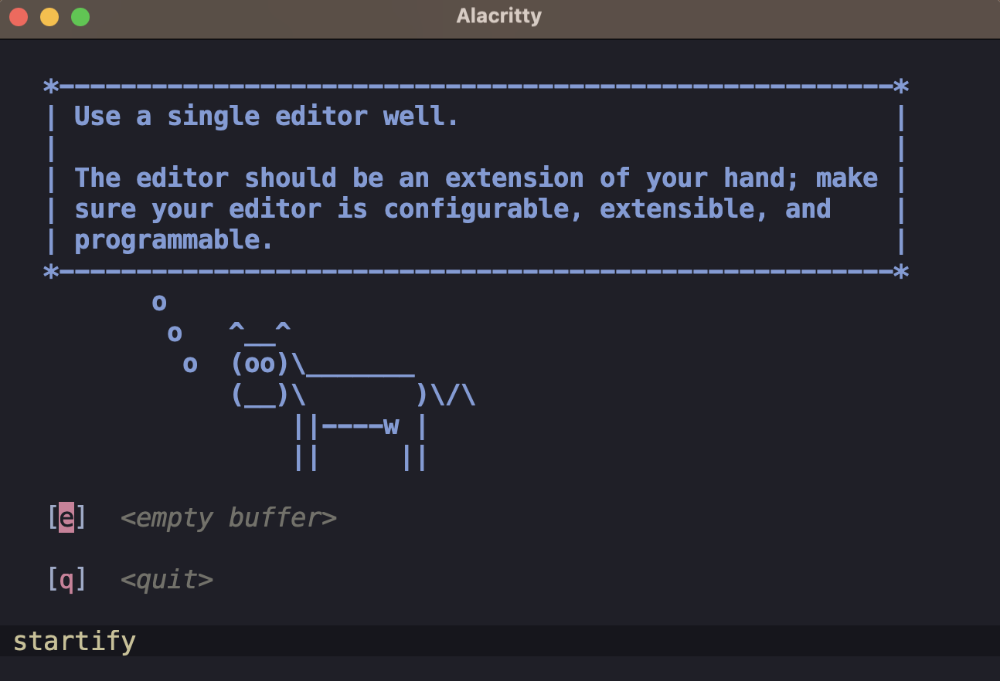
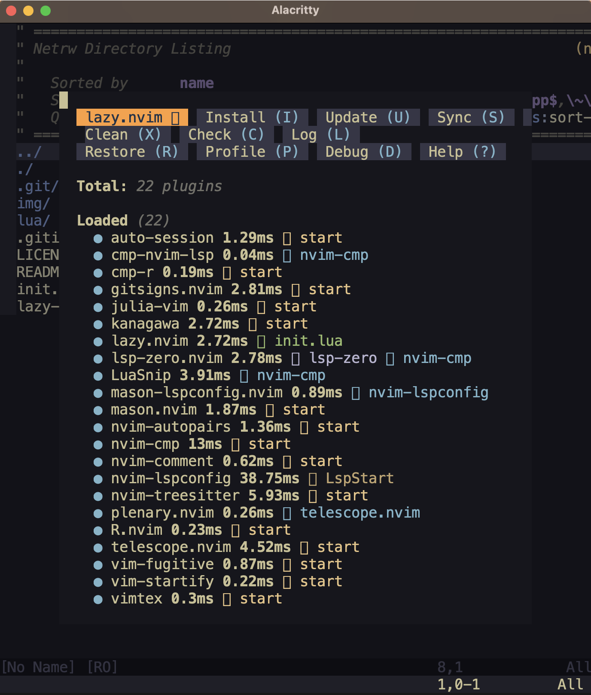

# Neo**vim** configuration for Mac arm64

## screenshots

<br>


## features

- goes well with [Alacritty](https://github.com/alacritty/alacritty)
- plugin manager: [lazy.nvim](https://github.com/folke/lazy.nvim)
- LSP setup: Lua, LaTeX, R, Python, Julia, OCaml.

## zsh

```zsh
brew --version
```
Homebrew 4.3.1

```zsh
echo 'eval "$(/opt/homebrew/bin/brew shellenv)"' >> ~/.zprofile

source ~/.zprofile
```

```zsh
brew install neovim

brew list --versions neovim
```
neovim 0.9.5

```zsh
brew install ripgrep

brew list --versions ripgrep
```
ripgrep 14.1.0

```zsh
brew install black

brew list --versions black
```
black 24.4.2

```zsh
brew tap homebrew/cask-fonts

brew install --cask font-hasklug-nerd-font

brew list --cask --versions font-hasklug-nerd-font
```
font-hasklug-nerd-font 3.2.1

```zsh
brew install --cask alacritty

brew list --cask --versions alacritty
```
alacritty 0.13.2

```zsh
brew install zsh-autosuggestions

echo "source $(brew --prefix)/share/zsh-autosuggestions/zsh-autosuggestions.zsh" >> ~/.zshrc

brew list --versions zsh-autosuggestions
```
zsh-autosuggestions 0.7.0

```zsh
brew install zsh-syntax-highlighting

echo "source $(brew --prefix)/share/zsh-syntax-highlighting/zsh-syntax-highlighting.zsh" >> ~/.zshrc

brew list --versions zsh-syntax-highlighting
```
zsh-syntax-highlighting 0.8.0

```zsh
brew install tmux

git clone https://github.com/tmux-plugins/tpm ~/.tmux/plugins/tpm

brew list --versions tmux
```
tmux 3.4_1

```zsh
echo "alias vim=nvim" >> ~/.zshrc

echo 'alias vimc='\''cd "$HOME/.config/nvim"'\''' >> ~/.zshrc

source ~/.zshrc
```

```zsh
cd $HOME/.config

git clone https://github.com/cb-g/nvim
```

```zsh
tmux new -s s
```
install tmux plugins with `ctrl-s shift-i`

launch:
```zsh
vimc

vim .
```

reset:
```zsh
rm -rf $HOME/.local/share/nvim
rm -rf $HOME/.local/state/nvim
rm -rf $HOME/.tmux
```

delete:
```zsh
rm -rf $HOME/.config/nvim
```

## ~/.config/alacritty/alacritty.toml

```toml
[colors]
transparent_background_colors = true

[window]
opacity = 0.75
decorations = "Buttonless"

[window.padding]
x = 0
y = 0

[window.dimensions]
columns = 700
lines = 90

[window.position]
x = 800
y = 150

[font.normal]
family = "Hasklug Nerd Font"

[env]
TERM = "xterm-256color"
```

## ~/.tmux.conf

```
set -g default-terminal "tmux-256color"
set -ag terminal-overrides ",xterm-256color:RGB"

set -g prefix C-s
unbind C-b
bind-key C-s send-prefix

unbind %
bind | split-window -h 

unbind '"'
bind - split-window -v

unbind r
bind r source-file ~/.tmux.conf

bind h resize-pane -L 4
bind j resize-pane -U 4
bind k resize-pane -D 4
bind l resize-pane -R 4

set -g mouse on

set -sg escape-time 1

## vim visual mode for tmux:
# set-window-option -g mode-keys vi
# bind-key -T copy-mode-vi 'v' send -X begin-selection # start selecting text with "v"
# bind-key -T copy-mode-vi 'y' send -X copy-selection # copy text with "y"
# unbind -T copy-mode-vi MouseDragEnd1Pane

## install plugins with ctrl-s shift-i
set -g @plugin 'tmux-plugins/tpm'
# set -g @plugin 'christoomey/vim-tmux-navigator'
## or customize
## 'alexghergh/nvim-tmux-navigation'
is_vim="ps -o state= -o comm= -t '#{pane_tty}' \
    | grep -iqE '^[^TXZ ]+ +(\\S+\\/)?g?(view|n?vim?x?)(diff)?$'"

bind-key -n 'C-h' if-shell "$is_vim" 'send-keys C-h' 'select-pane -L'
bind-key -n 'C-j' if-shell "$is_vim" 'send-keys C-j' 'select-pane -U'
bind-key -n 'C-k' if-shell "$is_vim" 'send-keys C-k' 'select-pane -D'
bind-key -n 'C-l' if-shell "$is_vim" 'send-keys C-l' 'select-pane -R'

tmux_version='$(tmux -V | sed -En "s/^tmux ([0-9]+(.[0-9]+)?).*/\1/p")'

if-shell -b '[ "$(echo "$tmux_version < 3.0" | bc)" = 1 ]' \
    "bind-key -n 'C-\\' if-shell \"$is_vim\" 'send-keys C-\\'  'select-pane -l'"
if-shell -b '[ "$(echo "$tmux_version >= 3.0" | bc)" = 1 ]' \
    "bind-key -n 'C-\\' if-shell \"$is_vim\" 'send-keys C-\\\\'  'select-pane -l'"

bind-key -n 'C-Space' if-shell "$is_vim" 'send-keys C-Space' 'select-pane -t:.+'

bind-key -T copy-mode-vi 'C-h' select-pane -L
bind-key -T copy-mode-vi 'C-j' select-pane -U
bind-key -T copy-mode-vi 'C-k' select-pane -D
bind-key -T copy-mode-vi 'C-l' select-pane -R
bind-key -T copy-mode-vi 'C-\' select-pane -l
bind-key -T copy-mode-vi 'C-Space' select-pane -t:.+

## this must be here on the final line
run '~/.tmux/plugins/tpm/tpm'
```

## references 

- [CadeMichael](https://github.com/CadeMichael/nvim)
- [cpow](https://github.com/cpow/neovim-for-newbs/)
- [agalea91](https://github.com/agalea91/zazencodes-youtube/tree/main/src/neovim-lazy-ide-2024)
- [ThePrimeagen](https://github.com/ThePrimeagen/init.lua/tree/249f3b14cc517202c80c6babd0f9ec548351ec71)
- [josean-dev](https://github.com/josean-dev/dev-environment-files)
